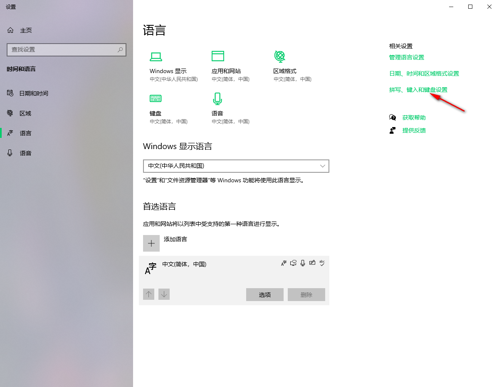
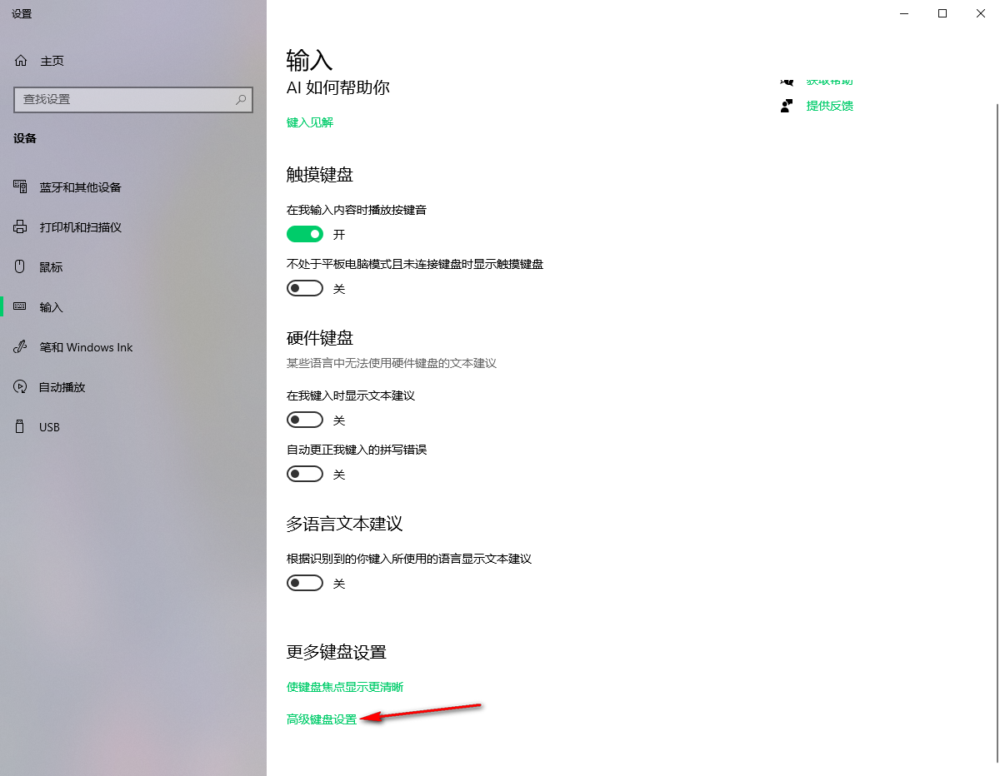
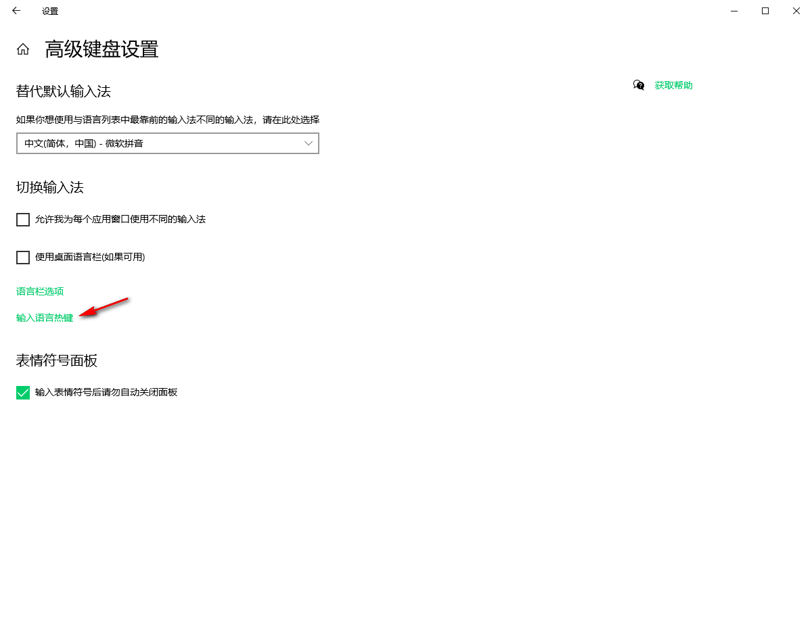
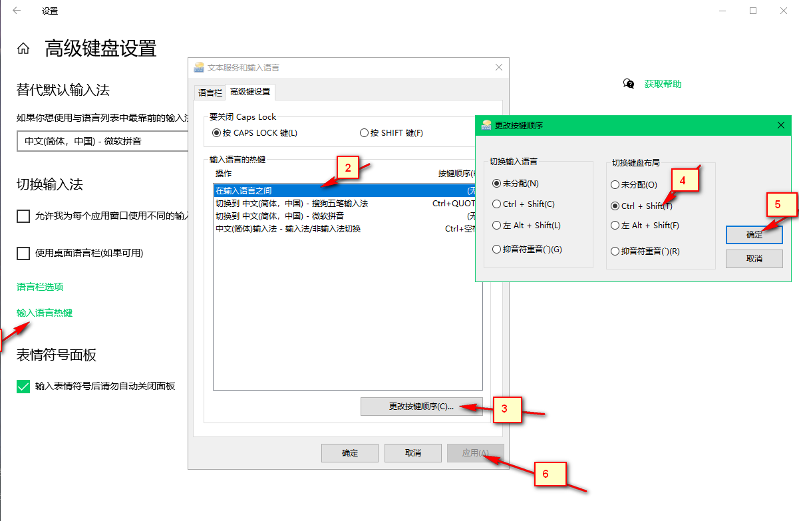

### 如何在win10延续win7的输入习惯  
作为一个顽固份子，我最近也终于从win7升级到了win10，然而升级后的体验是输入法十分难用，感觉和win7比甚至倒退了。  
槽点如下：  
1、ctrl+shift无法在所有输入法之间切换，只能在英文和另一种输入法间来回切换。  
2、在中文输入法时，按了几个字母后如果想直接把这几个字母上屏，在win7是直接按下shift就可以了，但是在win10不行。  
3、接上一条，在win10上这个样操作后，输入法会成英文状态，但是很可能变得无法输入回车、退格等，需要按shift回到中文状态清除掉那几个字符后才会正常。  
4、输入法响应缓慢，还很容易卡死正在输入的应用。  
。。。  

以上的种种，令人想把知乎上的win10吹抓住暴打一顿。。  
后来，偶然发现家里升级的win10用着好像还算正常，于是经过对比和实验，发现win10也是可以做到和win7体验接近的，只是需要额外的设置。  

先说下原因：  
win10扩展了两个概念：【输入语言】和【键盘布局】  
以前win7上所有输入法都是平等的，而在win10上不一样了，可以多种输入法属于同一种输入语言的不同键盘布局。  
因此，win10不存在一个可以在所有输入法间切换的快捷键，只有在输入语言间切换或在键盘布局间切换的快捷键。  
例如，升到win10后的输入法可能是这样一种关系： 

|输入语言|键盘布局|
|:-:|:-:|
|英语(美国)|美式键盘 键盘|
|中文(简体，中国)|微软拼音、qq拼音、搜狗拼间、搜狗五笔。。。。。。|  

好了，那么应该怎么做呢？  
主要分为两步：  
1、在输入语言中删除英语。  
2、把切换键盘布局的快捷键设为ctrl+shift。（注意是切换键盘布局，不是切换输入语言）  

第一步的意义有二：  
1、删除英语后就只剩中文语言了，使用时可以减少干扰。  
2、更重要的是，删除英语后，中文输入法的卡顿和无法回车退格bug会消失，神奇不神奇。  

顺便一提删除英语前需要把语言的各个首选项都设为中文，让中文在语言列表里排在最前面。  
另外有可能删除英语后重启又会自动添加回右下角的输入法栏，但是不影响。如果要彻底删除可能需要改下注册表，可以百度下。  

最后，放上图片说明：  
1、  
  
2、  
  
3、  
  
4、  

